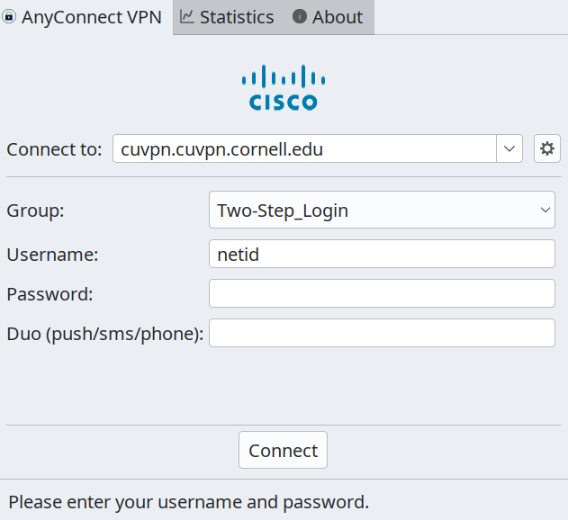
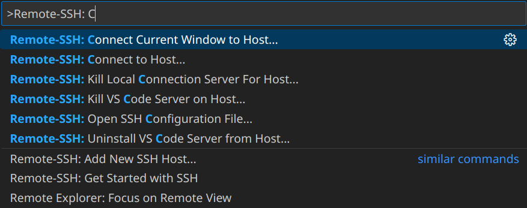

# ECE Linux Server Remote Access
Most of your ECE coursework will be completed remotely, by logging into the cluster of ecelinux servers. The ecelinux servers all run the Red Hat Enterprise Linux operating system with identical setups. First, you do not need to do anything to create an ecelinux account. You will be using your NetID and Cornell password to login, and an ecelinux account will be automatically created for you. Any student enrolled in an ECE class should automatically be granted access to the ecelinux servers. With that said, please reach out to the course staff if you cannot log in.

Later tutorials will discuss how to use the Linux command line and the git version control system. However, this tutorial focuses on how to initially setup remote access to the ecelinux servers. First, you will connect to the Cornell VPN. Then, you will open a remote shell and log in. Any terminal emulator should do the trick, but we recommend using PowerShell on Windows or Terminal on Mac. After logging in, the tutorial will introduce Visual Studio Code (VS Code), which provides a very nice graphical interface to supplement the command line.

## 1. Connecting to the Cornell VPN
If you are logging into the ecelinux servers from an on-campus network (i.e., using the Cornell wired or wireless network), then you do not need to enable the Cornell virtual private network (VPN). However, if you are off campus, then you will need to connect the Cornell VPN whenever you want to use the ecelinux servers. The VPN provides an extra layer of security, and more information about the Cornell VPN is available here:

[https://it.cornell.edu/landing-page-kba/2605/5273](https://it.cornell.edu/landing-page-kba/2605/5273)

Simply follow the instructions at the above link to install the Cisco VPN software for your operating system. Basic troubleshooting steps can be found at the following link.

[https://it.cornell.edu/landing-page-kba/2605/823](https://it.cornell.edu/landing-page-kba/2605/823)

Logging into the VPN requires (1) your NetID, (2) your password, and (3) your Duo Mobile authenticator. Notice in the screenshot below, then second password field labeled 'Duo'. There you will enter 'push' and clicking 'Connect' should trigger a Duo notification.

{ width="400", align=center }

## 2. Remote Access via Terminal Emulator
Any terminal emulator should be able to connect to ecelinux, but we recommend using PowerShell on Windows or Terminal on Mac. Both enable you to operate your computer from the command line. Moreover, they also enable secure, remote access to other systems. We will use the `ssh` command (short for secure shell), and then we will practice some simple actions like manipulating files.

### 2.1. Starting PowerShell or Mac Terminal
First, you must be connected to the Cornell VPN if you are off campus. To start PowerShell, click the Start menu then search for Windows PowerShell. To start Mac Terminal, go to your Applications folder and choose Utilities > Terminal. You can also open Spotlight, type Terminal, and press enter.

### 2.2. Logging into ecelinux Servers with PowerShell or Mac Terminal
After starting PowerShell or Mac Terminal, type in the following command at the command prompt:

```bash
$ ssh <netid>@ecelinux.ece.cornell.edu
```

Replace 'netid' with your Cornell NetID. Make sure not to enter the dollar sign---that is just the bash shell prompt. Executing this command correctly will ask you for your Cornell NetID password. If all is well, then you should be connected to the ecelinux servers.

The very first time you log into the ecelinux servers you may see a warning like this:

``` bash
 The authenticity of host ’ecelinux.ece.cornell.edu (128.253.51.206)’
 can’t be established. ECDSA key fingerprint is
 SHA256:smwMnf9dyhs5zW5I279C5oJBrTFc5FLghIJMfBR1cxI.
 Are you sure you want to continue connecting (yes/no)?
```

This is expected, and you can enter 'yes.' If you logged in successfully, your shell should look like this:

```
$ ssh netid@ecelinux.ece.cornell.edu
netid@ecelinux.ece.cornell.edu's password: 
*******************************************************************************
                   THIS SERVER IS FOR INSTRUCTIONAL USE ONLY
              ABSOLUTELY NO RESEARCH SHOULD BE DONE ON THIS SERVER

       JOBS RUNNING LONGER THAN 30 MINUTES MAY BE KILLED WITHOUT WARNING

                              System Maintenance
Tuesday and Thursday mornings between 5am and 7 am. System may reboot during these
times.  Faculty may request postponement of this maintenance by sending an
email to itcoecis-help@cornell.edu
*******************************************************************************
[netid@ecelinux-20 ~]$ 

```

### 2.3. Nano Text Editor
Now that you are online, let's try to use a simple command line program. Nano is a text-based editor installed on all linux machines. To experiment with `nano`, we will first grab a text file to edit from the internet with the `wget` command.

```bash
$ wget https://pastebin.com/raw/xsf10vFR -O myfile.txt
```

Notice that the file is now in on working directory:

```bash
$ ls
myfile.txt
```

We can now open this file and edit it with `nano`:

```bash
$ nano myfile.txt
```

Notice that the editor shows most of the useful commands at the bottom of the terminal. The symbol \^ signifies the CONTROL key. To type any text you want, just move the insertion point around using your arrow keys. Let's add 'Hello ECE!' to the end of the file. To exit and save your changes, press CONTROL+X, Y to save, and then ENTER to use the same file name. Congrats! We can test that our file was updated with `cat`:

```bash
$ cat myfile.txt
Hello wget!
Hello ECE!
```

## 3. Remote Access via VS Code
While you can complete all your coursework with just a terminal, it is not the most productive setup. We strongly recommend using VS Code as your primary option for code development on ecelinux.

VS Code runs the GUI interface on your personal computer, but executes your actions on the remote computer. This enables you to use ecelinux as if it is your own computer. All you need is VS Code plus the [remote ssh extension](https://marketplace.visualstudio.com/items?itemName=ms-vscode-remote.remote-ssh). But first, here is more information on how to install VS Code in the first place. 

### 3.1. Installing VS Code on Your Laptop/Workstation
You can download VS Code by simply going to the main VS Code webpage: [https://code.visualstudio.com](https://code.visualstudio.com)

There are no special steps required. However, you may want to consider [disabling telemetry](https://code.visualstudio.com/docs/getstarted/telemetry#_disable-telemetry-reporting) for security concerns.

Here are some VS Code extensions you will more than likely use for your coursework:

  * [remote ssh extension](https://marketplace.visualstudio.com/items?itemName=ms-vscode-remote.remote-ssh)
  * [C/C++](https://marketplace.visualstudio.com/items?itemName=ms-vscode.cpptools)
  * [clangd for C++](https://marketplace.visualstudio.com/items?itemName=llvm-vs-code-extensions.vscode-clangd)
  * [Verilog HDL](https://marketplace.visualstudio.com/items?itemName=mshr-h.VerilogHDL)
 
### 3.2. Logging into ecelinux Servers with VS Code
As a reminder, you must be connected to the Cornell VPN to access ecelinux off-campus. After starting VS Code, choose View > Command Palette from the menubar. Enter the command `Remote-SSH: Connect Current Window to Host` in the command palette:

{ width="600", align=center }

As you start typing the command, you can just click the correct option when you see it. VS Code will then ask you where to connect to. You should enter `netid@ecelinux.ece.cornell.edu`.

Of course, replace netid with your Cornell NetID. If you are on Windows, then you may see a pop-up which says 'Windows Defender Firewall has blocked some features of this app.' This is not a problem. Simply click 'Cancel.' You may also see a drop down asking you to choose the operating system of the remote host. *Choose Linux. This is the operating system of ecelinux.*

Now VS Code should prompt you to enter your Cornell NetID password. Logging into ecelinux with VS Code for the first time may take up to a minute or two to initialize. Once the pop up dialog box goes away and you see 'SSH: ecelinux.ece.cornell.edu' in the lower left-hand corner of VS Code, then you know you are connected to the ecelinux servers.

The final step is to make sure your personal VS Code extensions are also installed on the remote host. Choose View > Extensions from the menubar. Instead of saying 'Install' it should now say 'Install in SSH: ecelinux.ece.cornell.edu.' Click this choice for the extensions you need. You should only need to do this once.

### 3.4. Using VS Code
VS Code includes an integrated file explorer. Choose View > Explorer from the menubar. Then, click on Open Folder. VS Code will then ask you to Open File Or Folder with a default of /home/netid. Click 'OK.'

You might see a pop-up which asks you 'Do you trust the authors of the files in this folder?' Since you will only be browsing your own files on the ecelinux server, it is fine to choose 'Yes, I trust the authors.'

This will reload VS Code, and you should now see a file explorer in the left sidebar. You can easily browse your directory hierarchy, open files by clicking on them, create new files, and delete files.

VS Code also includes an integrated terminal which will give you access to the Linux command line on the ecelinux servers. Choose Terminal > New Terminal from the menubar. You should see the same kind of Linux command line prompt that you saw when using either PowerShell or Mac Terminal. What is cool is that we can open new VS Code tabs from the command line:

```bash
$ wget https://pastebin.com/raw/xsf10vFR -O mynewfile.txt
$ code mynewfile.txt
```
Notice how the text file opened in a new tab at the top, and the terminal remains at the bottom. This enables you to have easy access to editing files and the Linux command line at the same time.

### 3.5. Troubleshooting Remote Access via VS Code
Sometimes VS Code just keeps asking you for your password forever or VS Code just hangs when you try to connect to the server. You can definitely ask the course staff for help, but you can also try to fix it on your own.

The first attempt is to kill the VS Code server on the host machine (ecelinux). Choose View > Command Palette from the menubar. Enter `Remote-SSH: Kill VS Code Server on Host` in the command palette.

The second thing to try is to delete the .vscode-server directory on the sever. How can you delete this directory if you cannot use VS Code to access the ecelinux servers? You can simply use PowerShell or Mac Terminal to log into the ecelinux servers. Once you have gained access to the Linux command line on the ecelinux servers, you can delete the .vscode-server directory like this:

```
$ rm -rf .vscode-server
```

**Be very careful with the rm command since it can permanently delete files!**

Lastly, you can also try to directly log into a specific ecelinux server. Instead of logging into ecelinux.ece.cornell.edu (which automatically picks an ecelinux server for you), you can log into `ecelinux-01.ece.cornell.edu`, `ecelinux-02.ece.cornell.edu`, and so on.
